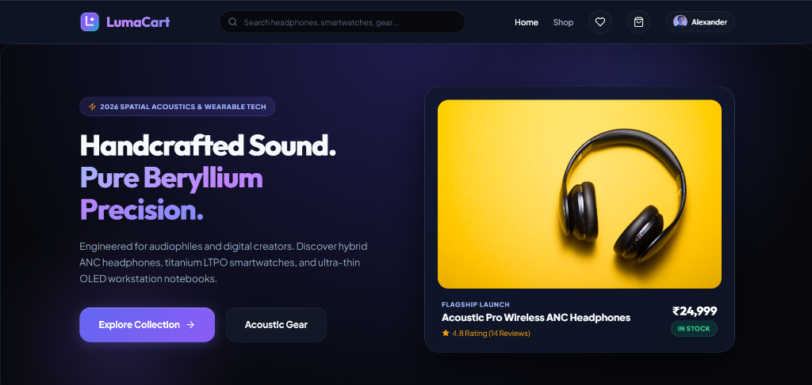

# 🛍️ LumaCart — Premium Luxury Tech E-Commerce Platform

[](https://github.com/Megha-r20/LumaCart)
[](https://react.dev/)
[](https://nodejs.org/)
[](LICENSE)

**LumaCart** is an editorial, luxury tech startup e-commerce platform built on the MERN stack (**MongoDB, Express.js, React, Node.js**). It offers a high-performance customer storefront localized in **Indian Rupees (₹)** paired with an executive SaaS administration console.



---

## ✨ Features Highlight

### 🛒 Customer Storefront
* **Obsidian & Electric Indigo Aesthetic**: Sleek dark mode design system built with custom CSS variables, glassmorphism backdrop blurs, and smooth micro-interactions.
* **Vector Brand Identity**: Custom vector SVG logo integrated seamlessly across the navigation bar, footer, auth flows, and browser favicon.
* **Product Catalog & Discovery**: Instant debounced search bar, category filter tabs, price range slider, star rating thresholds, and multi-option sorting.
* **Product Detail Experience**: Multi-angle image previewer, technical specifications tab, star rating breakdown, and verified customer review modal.
* **Shopping Bag (`/cart`)**: Full-screen shopping bag featuring a **₹5,000 Free Shipping Progress Meter**, interactive coupon application (`LUMA20` for 20% off), 18% GST tax calculation, item quantity modifiers, and itemized price breakdown.
* **Checkout & Payment Simulation**: Multi-step checkout with saved shipping address selector, credit card / UPI sandbox simulator, Stripe PaymentIntent endpoint integration, and order summary confirmation.
* **Order History & Timeline (`/orders`)**: Dedicated customer order tracking timeline (`Pending` ➔ `Processing` ➔ `Shipped` ➔ `Delivered`) with line-item detail view.
* **User Profile Portal (`/profile`)**: Executive hero avatar header, account detail manager, password update form, and shipping address directory modal.

### 📊 Executive Admin SaaS Console (`/admin`)
* **Role-Based Protection**: Strict JWT authorization restricting access to administrator accounts (`role === 'admin'`).
* **KPI Dashboard Grid**: Responsive executive analytics grid displaying Gross Revenue, Total Orders, Product Count, Registered Customers, and Low Stock alerts with `Recharts` data visualization.
* **Product Management**: Interactive inventory management with custom toggle switches for `In Stock` and `Featured` status, product creation, and stock updates.
* **Category Manager**: Create, edit, and organize product category taxonomies.
* **Order Fulfillment Center**: Centralized order directory with status filter tabs, audit note updates, and tracking number assignment.
* **Customer Directory & Review Moderation**: Customer account oversight and one-click review moderation.

---

## 🛠️ Tech Stack & Architecture

| Layer | Technologies & Tools |
| :--- | :--- |
| **Frontend** | React 18 (Vite), React Router v6, Lucide Icons, Recharts, Axios, HTML5 / Vanilla CSS Design System |
| **Backend** | Node.js, Express.js, Mongoose, MongoDB / MongoMemoryServer (Dynamic Auto-Fallback) |
| **Security & Auth** | JSON Web Tokens (JWT), bcryptjs password hashing, Protected Route Middleware, CORS |
| **Payments** | Stripe API (INR PaymentIntent Sandbox) |
| **Localization** | Indian Rupee (₹) Pricing, 18% GST Tax, ₹5,000 Free Express Shipping Threshold |

---

## 🔑 Demo Credentials

| Role | Email | Password | Access / Features |
| :--- | :--- | :--- | :--- |
| **Customer** | `user@lumacart.com` | `password123` | Storefront, Wishlist, Checkout, My Orders, Profile |
| **Executive Admin** | `admin@lumacart.com` | `password123` | Full Access + Executive Admin SaaS Console (`/admin`) |

> **Promo Discount Code**: Apply `LUMA20` at checkout for **20% OFF** your cart subtotal.

---

## 🚀 Getting Started Locally

### Prerequisites
* **Node.js** (v18.0.0 or higher)
* **npm** (v9.0.0 or higher)

### 1️⃣ Clone the Repository
```bash
git clone https://github.com/Megha-r20/LumaCart.git
cd LumaCart
```

### 2️⃣ Start Backend Server
```bash
cd backend
npm install
npm start
```
> *Note: If a local MongoDB instance is not detected, the backend will automatically spin up an **in-memory MongoDB database** (`MongoMemoryServer`) and seed initial product, user, and order datasets automatically.*

### 3️⃣ Start Frontend Development Server
In a new terminal window:
```bash
cd frontend
npm install
npm run dev
```

### 4️⃣ Open in Browser
* **Customer Storefront**: [http://localhost:3000](http://localhost:3000)
* **Admin SaaS Console**: [http://localhost:3000/admin](http://localhost:3000/admin)
* **Backend API Health Check**: [http://localhost:5000/api/health](http://localhost:5000/api/health)

---

## 📁 Repository Structure

```text
LumaCart/
├── backend/
│   ├── config/          # Database configuration & MongoMemoryServer setup
│   ├── controllers/     # API request handlers (auth, products, orders, etc.)
│   ├── middleware/      # Auth & admin guard middlewares
│   ├── models/          # Mongoose database schemas
│   ├── routes/          # Express API route endpoints
│   ├── utils/           # Database seeder script
│   ├── server.js        # Express application entry point
│   └── package.json
├── frontend/
│   ├── public/          # Vector SVG brand logo & favicon assets
│   ├── src/
│   │   ├── components/  # Navbar, Footer, CartDrawer, OrderTimeline, ProductCard
│   │   ├── context/     # Auth, Cart, and Wishlist React Contexts
│   │   ├── pages/       # Home, Shop, ProductDetail, Cart, Checkout, Profile, Orders
│   │   │   └── admin/   # AdminLayout, Dashboard, ProductList, OrderList, etc.
│   │   ├── styles/      # main.css (Luxury dark obsidian design system)
│   │   └── main.jsx
│   ├── vite.config.js
│   └── package.json
└── README.md
```

---

## 📜 License
This project is open-source and available under the [MIT License](LICENSE).
